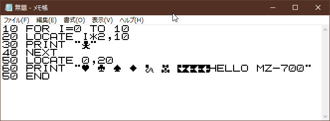
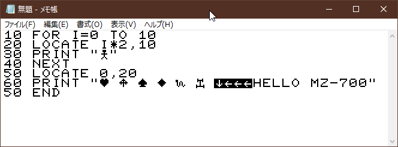
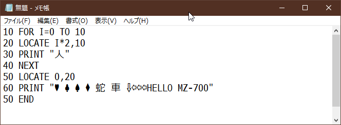
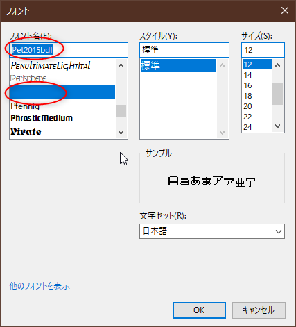

<!-- -*- encoding: utf-8 -*- -->

mz700fon2bdf
===============

8x8ドットのMZ-700風互換ビットマップフォント画像をBDFに変換、かつ、TTFに変換できるか実験。

Screenshots
-----------

Pet2015bdfフォント利用時の画面



Mz700bdfフォント利用時の画面



メイリオフォント利用時の画面



Usage
-----

### BDF生成

8x8ドット、16x32個の文字が並ぶフォント画像(.png)から、BDFフォントを生成。Windows10上で作業。

```bat
mkbdf.bat
```

内容は以下。
```bat
python mz700fon2bdf.py IMAGE.png BDF_HEADER.txt --defchar 32 --convlist CODE_LIST.csv > OUTPUT.bdf
```

### 拡大BDFを生成

フォントサイズが8x8ドット(6pt)だけでは、さすがに全く使い物にならないので、拡大したBDFを数種類ほど生成する。Ubuntu Linux上で作業。

Ubuntu Linux 18.04 LTS上で、bdfresize をインストール。

```bash
sudo apt install bdfresize
```

拡大BDFを生成。

```bash
bdfresize -f 2 hoge_x1.0.bdf > hoge_x2.0.bdf
bdfresize -f 3 hoge_x1.0.bdf > hoge_x3.0.bdf
bdfresize -f 4 hoge_x1.0.bdf > hoge_x4.0.bdf
bdfresize -f 5 hoge_x1.0.bdf > hoge_x5.0.bdf
bdfresize -f 3/2 hoge_x1.0.bdf > hoge_x2.5.bdf
bdfresize -f 5/2 hoge_x1.0.bdf > hoge_x3.5.bdf
bdfresize -f 7/2 hoge_x1.0.bdf > hoge_x4.5.bdf
bdfresize -f 9/2 hoge_x1.0.bdf > hoge_x5.5.bdf
```

### TTFに変換

bdf2ttf を利用して、BDFからTTFに変換。Windows10上で作業。

[koron/bdf2ttf: Convert BDF font file to TTF (embed bitmap as is, not conver to vector)](https://github.com/koron/bdf2ttf)

```bat
mkbdf.bat
```

内容は以下。
```bat
bdf2ttf OUTPUT.ttf hoge.ini INPUT_x1.0.bdf INPUT_x2.0.bdf INPUT_x3.0.bdf INPUT_x4.0.bdf INPUT_x5.0.bdf 
```

Note
----

* 生成されたTTFは、アウトラインフォントが無く、ビットマップフォントが埋め込まれている状態。
* Windows上では、6, 12, 18, 24, 30ptのフォントサイズを指定すると表示できる。それ以外のサイズを指定しても表示されない。
* 6ptを指定した際に、8x8ドットのフォントが表示される。
* 12, 18, 24, 30pt は、整数倍のフォントサイズで表示される。
* 全角文字を入力すると、カタカナ、ひらがな、図形文字が入力できる。
* どの文字が、どのUTF-8コードに割り当てられているかは、[chara_map/chara_conv_map.txt](./chara_map/chara_conv_map.txt) を参照。
    * Windows10 x64 1809 + MS-IME の場合、以下の単語を入力して変換すると、図形文字その他が利用できる。
        * 「ぶろっく」「しかく」「けいせん」「まる」
        * 「やじるし」「うえ」「した」「ひだり」「みぎ」
        * 「はーと」「くらぶ」「すぺーど」「だいあ」
        * 「車」「横」「人」「八倒」「逆」「蛇」「未」「押」
        * 「日月火水木金土」「生年時分秒」「ぽんど」
        * 「濁点」「半濁点」
* フォント選択時、アプリによっては、フォント名が空欄になる。(フォント名表示に使うフォントサイズが存在しないため。)



File list
---------

* mkbdf.bat : BDF生成バッチファイル
* mkttf.bat : BDFからTTFに変換するバッチファイル。bdf2ttf が必要。
* mz700fon2bdf.py : 画像からBDFを生成するスクリプト
* pet2015*.png : MZ-700互換フォント画像。8 x 8ドット、16 x 32個の文字が並ぶ。
* mz700*.png : MZ-700フォント画像。8 x 8ドット、16 x 32個の文字が並ぶ。
* convlist.csv : UTF-8コード割り当て指定リスト。
* bdf_header/*.txt : BDFのヘッダー部分
* *.ini : BDFからTTFに変換する際必要な情報ファイル
* bdf/*.bdf : 生成したBDFファイル
* ttf/*.ttf : 生成したTTFファイル

Requirement
-----------

* Windows10 x64 1809
* Python 2.7.16 32bit
* Pillow (PIL) 6.0.0


### Optional

拡大したBDFを生成する場合は以下が必要。

* Ubuntu Linux 18.04 LTS
* [bdfresize](https://packages.ubuntu.com/bionic/bdfresize)

 BDF から TTF に変換する場合は以下が必要。

* [bdf2ttf](https://github.com/koron/bdf2ttf)

License
-------

* mz700fon2bdf.py : CC0 / Public Domain
* pet2015*.* : CC0 / Public Domain

pet2015ビットマップフォントは、MZ-700風互換フォント。英数字、カタカナ、ひらがな部分はmieki256がドット打ちして自作したので自由に使えます。

* mz700*.png : 不明。Unknown


Author
------

[mieki256](https://github.com/mieki256)


